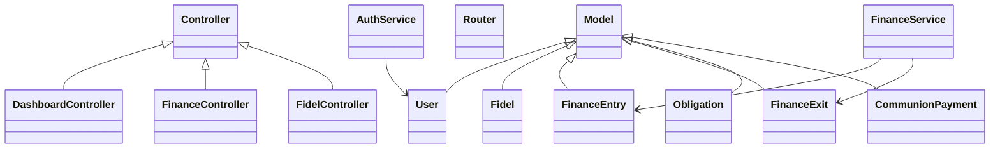

# Diagrammes UML

## Cas d’utilisation

```mermaid
usecaseDiagram
actor Admin
actor User
actor Visiteur
Admin --> (Gérer utilisateurs)
Admin --> (Consulter dashboard admin)
Admin --> (Exporter rapports)
User --> (Ajouter entrée financière)
User --> (Ajouter sortie financière)
User --> (Gérer fidèles)
User --> (Gérer obligations)
User --> (Gérer communion)
Visiteur --> (Consulter dashboard lecture seule)
Visiteur --> (Voir graphiques)
```

## Classes principales


